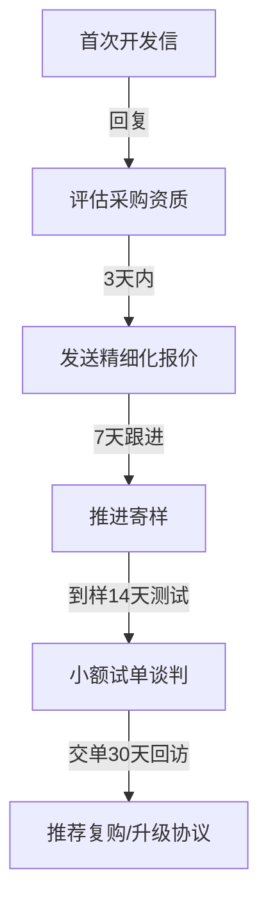

# B2B 外贸客户生命周期管理知识库 v2.0

## 一、B2B 外贸客户生命周期 7 阶段定义

1. **Lead（潜在潜客）**：通过展会、海关数据或搜索获得的客户名录，尚未建立双向联系。
2. **Contacted（初次触达）**：已发送首封开发信，等待或刚刚获得对方初步回复。
3. **Qualified（合格线索）**：买家表达了具体的产品需求或要了产品目录，确认其采购资质。
4. **Quoted（方案报价）**：已向买家提交正式报价单，处于商谈与议价阶段。
5. **Sampled（样品确认）**：买家已支付或要求免费寄样，正进行产品质量与技术检测验证。
6. **First-Order（试单客户）**：首笔小额订单（试单）成交，处于生产、交期、物流跟进阶段。
7. **Retained（长期复购）**：试单成功，进入年度框架协议阶段，实现持续且有规律的复购。

---

## 二、客户流失信号识别机制

- **互动流失信号**：
  - 邮件打开率从 >80% 跌至 <20%（通过连接器邮件追踪检测）。
  - 对常规问候、市场动态分享、节假日问候连续 3 次无回应。
- **业务流失信号**：
  - 试单到港 30 天内，拒绝对产品质检结果给予正面评价。
  - 频繁询问超出合同范围的细节，索要质量认证文件（可能是为寻找备选供应商做合规准备）。
  - 年采购订单频次明显放缓（如从每月下单降为双月下单）。

---

## 三、外贸跟进节奏设计（首次接触 → 复购）

- **报价到样品的跟进频率**：每 3-5 天跟进一次，内容应以解决买家技术疑问、提供应用案例、解释模具成本为主，避免单一催单。

---

## 四、沉默客户分级激活话术库

### 1. 阶段一：沉默 1-3 个月（轻度沉默）
- **策略**：分享行业动态、原材料价格走势或新品上线，降低防备心理。
- **话术示例**：
  > *"Hi [Name], I noticed stainless steel 304 raw prices in Asia just dropped 4% this week, which might impact your Q3 procurement budget. I've attached our updated pricing index for your reference."*

### 2. 阶段二：沉默 3-6 个月（中度沉默）
- **策略**：直接询问项目进展，提供独家折扣或少量免费样品名额。
- **话术示例**：
  > *"Hi [Name], we are scheduling our monthly sample production line next Tuesday. If you have any ongoing testing needs for [Product], we can waive the $150 tooling fee for 5 units."*

### 3. 阶段三：沉默 6 个月以上（深度沉默）
- **策略**：重新介绍公司新认证，或进行产品迭代升级的彻底唤醒。
- **话术示例**：
  > *"Hi [Name], since we last spoke, our production facility has achieved TÜV SÜD certification for automotive-grade seals. We'd love to re-introduce our capabilities for your new vendor review cycle."*

---

## 五、关键营销节点时机

- **时区感知发送**：发送开发信/跟进信应在买家当地时间周二至周四上午 9:30-11:00，此时邮件处理效率最高。
- **大节点公关**：
  - 圣诞/新年：提前 15 天送去定制化问候，而不是群发贺卡。
  - 展会（如广交会、汉诺威工业博览会）：提前 30 天向流失或沉默客户发出观展邀请。
