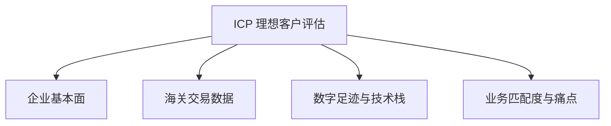

# 理想客户画像（ICP）定义与精准开发知识库 v2.0

## 一、外贸 B2B 理想客户画像（ICP）四大评估维度

1. **企业基本面（Firmographics）**：
   - 公司规模、年营收估算、采购人员所在部门与决策权阶层。
2. **海关交易数据（Customs Transactions）**：
   - 是否为高频采购商、每年的采购货柜总量、当前的主力供应商分布。
3. **数字足迹与技术栈（Digital Footprints）**：
   - 网站流量来源、LinkedIn 员工数增幅（反映企业处于扩张期还是收缩期）。
4. **业务匹配度（Business Alignment）**：
   - 我们的产品线与对方的经销品类契合度，是否存在未满足的交期/技术缺陷痛点。

---

## 二、核心买家意向信号库（Buyer Signals）

- **弱信号（培育期）**：
  - 访问我司独立站产品页停留时间超过 2 分钟。
  - 在谷歌搜索我司主推的 HTS 编码品类。
- **强信号（开发期）**：
  - 下载了我司最新的精密图纸与目录。
  - 在展会上索要了具体型号的试样样品。
- **超强信号（成交关口）**：
  - 核心决策人（Procurement Director/CEO）在 LinkedIn 上接受了销售的联络请求并询问交期。
  - 买家明确要求进行厂审（Factory Audit）。

---

## 三、外贸线索打分（Lead Scoring）模型与分级判定

综合评分为 `0-100` 分，打分指标权重分布如下：

### 1. 域名与背景分（权重 30%）
- 企业独立邮箱：+20分；免费邮箱（Gmail等）：-10分。
- 官网正常且 LinkedIn 员工数 >50 人：+10分。

### 2. 采购历史匹配度（权重 40%）
- 海关数据显示近 1 年有同类品类进口记录：+30分。
- 目前从中国进口过货物（懂中国供应链规律）：+10分。

### 3. 询盘内容质量分（权重 30%）
- 询盘带有具体技术图纸、规格和起订量 MOQ：+30分。
- 仅泛泛要价（"Please send catalog"）：+5分。

### 4. 线索路由判级
- **Score >= 80**：S 级线索，触发 `L2_fallback`，销售优先极速跟进。
- **60 <= Score < 80**：A/B 级常规线索，交由 `agent-001` 等智能体进行序列化开发信触达。
- **Score < 60**：C/D 级，自动进入常态化邮件营销（EDM）培育队列。
